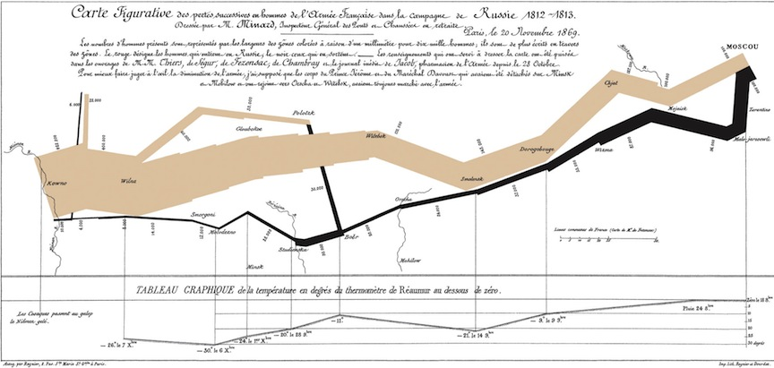

## See these more thorough overviews: ##

*  [Roger Bivand](http://www.asdar-book.org/) - very highly recommended, and the basis for much of my material
*  [notes and tutorial](http://www.columbia.edu/~cjd11/charles_dimaggio/DIRE/resources/spatialEpiBook.pdf)
*  [chapter on spatial mapping of overdose deaths](http://academiccommons.columbia.edu/catalog/ac%3A127786)
*  [course exercise](http://www.columbia.edu/~cjd11/charles_dimaggio/DIRE/resources/R/practicalsBookNoAns.pdf)

## Let's wade right in... ##


## first steps ##

* install and load *sp* and *maps*
* load the *meuse* data set
* examine the structure of *meuse*
	* dataframe, 155 observations, 14 variables
	* *x* and *y* are map coordinates

## plotting the meuse data ##


```{.r .numberLines}
plot(meuse)
plot(meuse$x, meuse$y)
plot(meuse$y, meuse$x)
```


## SpatialPointsDataFrame object ##

* spatially-referenced points with attribute data
* sp:coordinates() will convert R dataframe to SpatialPointsDataFrame


```{.r .numberLines}
coordinates(meuse) <- ~x+y
str(meuse)
plot(meuse)
```


## categorize and plot flood frequencies ##


```{.r .numberLines}
meuse$ffreq <- as.numeric(meuse$ffreq)
plot(meuse, col = meuse$ffreq, pch = 19)
labs <- c("annual", "every 2-5 years", "> 5 years")
cols <- 1:nlevels(meuse$ffreq)
legend("topleft", legend = labs, col = cols, pch = 19, bty = "n")
```


## working with spatial objects ##

* Spatial objects are *S4* objects
* note in str() output, uses the *@* convention
* e.g. names(meuse@data)
* some special spatial tools, e.g select.spatial() to identify points
* select.spatial(meuse)
	* click three points to surround (don't have to completely surround)
	*  R click to return point data
* generic plot() return spatially-referenced results, e.g plot()
* ...but special spatial plots are available


```{.r .numberLines}
spplot(meuse, "zinc")
bubble(meuse, "lead")
```


## coordinate reference systems ##
* definitions for the location of a point on the earth
* *reference ellipsoid* -  defines shape of the earth
* *datum* - reference point(s) on earth's surface
* unit of measurment, e.g. meters, miles
* projection - how spherical earth projected onto 2 dimensions
	* equirectangular
	* cylindrical or Mercator’s
	* conical 

## Example CRF ##	

* meuse coordinates referenced to Netherlands RDH topographical convention
* sp:proj4string() uses *rgdal* library to specify a CRS
* sp:spTransform() will change from one CRS to another
	* e.g.  


```{.r .numberLines}
proj4string(meuse) <- CRS("+init=epsg:28992")
```

## Why map? ##

* Just because you can doesn't mean you should
* text for a few numbers
* table for many numbers
* plots for relationships
* maps for patterns in space and time...

## The greatest map? ##



## The greatest map ##

* Edward Tufte might say yes
* enormous amount of data laid out in organized, understandable fashion
* multi-media presentations of lines, numbers, pictures, narrative
* no proprietary platform, easily accessible by multiple users
* entirely content, e.g. no drop shadows, bullet indents etc...
* genuinely interactive (people instinctively look for familiar areas, etc...)


## Minard's Map Illustrates 6 principals (6 C's) of analytic design and mapping (from Tufte)
* 1. comparisons, contrasts and differences
	* pre-post troop levels illustrated at beginning and end (started with 400K, ended with 10K)
* 2. causality and connections
	* path of retreating army tied to a temperature scale at bottom
* 3. complexity and multivariate data
	* six dimensions of data on the map: size of the army, location in lat and long, direction, temperature, places
* 4. cleverness, and innovative methods (use 'whatever it takes' to explain something)
	* map is annotated all over with numbers and words
* 5.  credibility, by documenting the source of your data
	* two paragraphs at top are about sourcing and detail
* 6. content is king, tell a compelling story, ultimately stand or fall on the quality, integrity and relevance  of your content
	* Minard's map is essentially an anti-war poster telling a compelling story

## Spatial Analysis ##

* See online presentation by [Dave Unwin](http://www.revolutionanalytics.com/news-events/free-webinars/2012/spatial-analysis-in-r/)
* location as an explanatory variable
	* patterns in space, e.g. clustering
	* spatially varying risk
	* geographic or local covariates
* spatial data have additional structure
	* morphology - point, line, areal
	* geography - lat/long, CRS
	* attributes - elevation, population, measurements


## R and Spatial Analysis ##

* familiar, unifying analytic environment
* many specialized packages and functions available
	* ability to translate most any spatial data
* rapidly incorporate advances
* growing, almost invariably supportive community

## R spatial data ##

* spatial data frame - fundamental spatial R object
	* translates Cartesian coordinates to geography
* 3 important attributes
	* x/y become lat/long
	* Coordinate Reference System (CRS) relates lat/long to earth
	* "bounding box" to display the data

## R spatial packages ##

* "base" packages - sp, maptools, rgdal
	* useful utilities to read in, transform, display, manipulate spatial data
* spatial statistics - gstat, geoR, spBayes
* areal data - spdep, DCluster, ade4, SpatialEpi
* point pattern data - spatial, splancs. spatstat

## 3 Basic Applications ##

* areal (or lattice) data
	* is there spatial variation?
	* if so, does pattern of spatial variation help explain why?
* point pattern data
	* are there clusters?
	* if so, does pattern help explain why?
* spatial interpolation
	* convert discrete observations to continuous fields
	* is the variable actually continuous, e.g. elevation, rain fall, temperature?
	* given a sample, what is the value at some non-measured location?


## Areal Data: Suicide Mortality in 32 London Boroughs  1989-1993 ##
*	data from Congdon (2007) via Blangiardoa et al (2013)   

* read in data


```{.r .numberLines}
library(maptools)
library(spdep)

london<-readShapePoly(" ~ download ~ /LDNSuicides")
plot(london) ## NB: no CRS
class(london)
names(london)
london$NAME

obs=c(75,145,99,168,152,173,152,169,130,117,124,119,134,90,
    98,89,128,145,130,69,246,166,95,135,98,97,202,75,100,
    100,153,194) ## observerd number suicides each london borough
exp=c(80.7,169.8,123.2,139.5,169.1,107.2,179.8,160.4,147.5,
    116.8,102.8,91.8,119.6,114.8,131.1,136.1,116.6,98.5,
    88.8,79.8,144.9,134.7,98.9,118.6,130.6,96.1,127.1,97.7,
    88.5,121.4,156.8,114) ## expected number suicides each london borough
```

* create dataframe of borough names, observed, expected
	* data is in alphabetical order, so have to sort the names from the spatial dataframe


```{.r .numberLines}
NAME<- sort(london$NAME)
suicide.dat <- data.frame(NAME=NAME, obs=obs, exp=exp)
```

* calculate crude and empirical Bayes smoothed SMRS
	* NB: spdep tool probmap() calculates SMRs using population numbers


```{.r .numberLines}
suicide.dat$SMR<-suicide.dat$obs/suicide.dat$exp

library(DCluster)
suicide.dat$smooth <- empbaysmooth(suicide.dat$obs,suicide.dat$exp)$smthrr
```

## map the results

* reorder data file to match order in the spatial file

```{.r .numberLines}
data.london<-attr(london,"data")
order<-match(data.london$NAME,suicide.dat$NAME)
suicide.dat<-suicide.dat[order,]
```

* establish and apply cut off values to categorize
* merge the smrs to spatial dataframe by name
* spplot to map


```{.r .numberLines}
cuts<- c(0.6, 0.9, 1.0, 1.1,  1.8)
suicide.dat$SMR.cut<-cut(suicide.dat$SMR,breaks=cuts,include.lowest=TRUE)
suicide.dat$smooth.cut<-cut(suicide.dat$smooth,breaks=cuts,include.lowest=TRUE)
attr(london,"data")<-merge(data.london,suicide.dat,by="NAME")

spplot(london, c("SMR.cut", "smooth.cut"),col.regions=gray(3.5:0.5/4),main="")
```

* NB: Never use crude SMRS  
	* In this example crude SMR's are very close to smoothed
	* But this will generally not be so
	* crude SMRs are notoriously unstable and can be misleading...


## Point Process Data: Broad Street Pump Cholera Outbreak ##
* What if John Snow had R?

## load packages, read data (with rgdal), plot ##

* data from [Robin T. Wilson] (http://blog.rtwilson.com/john-snows-cholera-data-in-more-formats/)
* GDAL - geospatial data abstraction library
	* installation something of a bear...


```{.r .numberLines}
library(spatstat)
library(rgdal)

cholera<-readOGR(" ~ download ~ /Cholera_Deaths.shp", "Cholera_Deaths")
pumps<-readOGR(" ~ download ~ /Pumps.shp", "Pumps")

plot(cholera, pch=16)
plot(pumps, add=T, col="red", pch=10, cex=3)
```


## plot with background image ##

```{.r .numberLines}
bkgrnd<-readGDAL(" ~ download ~ /SnowMap.jpg")

plot(cholera, pch=16)
image(bkgrnd,col = grey(1:99/100), add=T)
plot(cholera, pch=16, add=T, col="red")
plot(pumps, add=T, col="blue", pch=10, cex=3)
```

## plot the point process with spatstat ##
* convert sp to ppp
* summarize and simple plot
* plot density comparing 2 bandwidths
	* overlay pump sites
* perspective plots
	* theta= option for view


```{.r .numberLines}
cholera.point<-as.ppp(cholera)
summary(cholera.point)
plot(cholera.point)

plot(density(cholera.point,20))
plot(density(cholera.point,30))
plot(pumps, add=T, col="red", pch=10, cex=3)


persp(density(cholera.point,30))
persp(density(cholera.point,30), theta=90)
persp(density(cholera.point,30), theta=180)
```

## Riply's K statistic

* solid black line is observed K function
* dashed blue is expected


```{.r .numberLines}
cholera.k<-Kest(cholera.point)
plot(cholera.k)
```


## Spatial Interpolation ##

* Inverse Distance Weighting (IDW)
	* use neighboring samples to estimate every location on fine grid
	* gstat package - option "e=" controls degree of smoothing
	* results in ring contour lines
	* close to what surveyor might draw
	* but can't assess error to externally validate
	* choice of smoothing exponent essentially arbitrary
	* clustered samples affect outcome
* variograms
	* estimate dependence between two points in space
	* distance on x-axis, semivariance on y axis
	* use to improve interpolations
* kriging
	* interpolation technique
	* incorporate variance for error estimates


